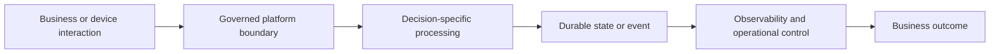

# ADR-010: Use Human-in-the-Loop Controls for Animal Welfare AI

- **Status:** Accepted
- **Decision owners:** Architecture, business capability owner, security, operations, and data/AI owners as applicable
- **Date:** To be assigned on approval
- **Related HLD:** Von Digitalis Estates digital platform
- **Supersedes:** None
- **Superseded by:** None

## Context

AI-assisted anomaly, feeding, image, and population analysis may inform animal-care decisions, but model output can be uncertain or incorrect.

The design must support growth from approximately 5,000 to at least 15,000 visitors per day, 40 rides, more than 200 animals across 55 displays and enclosures, intermittent estate connectivity, and business-critical ticketing and animal-care workflows. Final regions, SKUs, numeric SLOs, and cost commitments remain subject to non-functional requirements, load testing, compliance review, and cost analysis.

## Decision Drivers

- Business continuity and visitor safety
- Animal-welfare safeguards
- Scalability and operational supportability
- Security, privacy, and auditability
- Loose coupling and replaceability
- Measurable reliability, performance, and cost
- Avoidance of unvalidated product, capacity, and cost commitments

## Decision

Treat AI outputs as decision support, not autonomous animal-care decisions. Use confidence thresholds, evidence display, human review, override and escalation workflows, full traceability, and deterministic safety rules. Low-confidence, novel, or high-severity cases must be routed to qualified animal-care staff.

## Decision Flow

> The diagram is a decision-level view. Detailed component and sequence diagrams remain in the HLD scenario documentation.

## Alternatives Considered

- Fully autonomous intervention based on model output
- Do not use AI for animal monitoring
- Present predictions without confidence or evidence

## Consequences

- Animal-care accountability remains with authorized humans.
- Review workload and response time must be planned.
- Model quality, drift, false negatives, false positives, and override outcomes must be monitored.

### Positive

- Establishes an explicit design standard that downstream solution designs can validate against.
- Supports consistent security, observability, resilience, and governance controls.

### Negative or Trade-offs

- Introduces implementation and operational work that must be reflected in delivery plans.
- Requires evidence from NFR definition, performance testing, security review, and cost analysis before production approval.

## Security and Privacy Implications

- Apply least privilege, encryption in transit and at rest, managed identities where supported, and Key Vault for secrets and certificates.
- Minimize personal and sensitive data in payloads, logs, traces, prompts, and analytical stores.
- Record privileged and material business actions in tamper-resistant audit records.
- Perform threat modelling and privacy review before production release.

## Reliability and Failure Handling

- Use bounded retries, timeout budgets, circuit breakers, bulkheads, idempotency, and dead-letter handling where relevant.
- Define deterministic degradation behavior for dependency, connectivity, and AI failures.
- Validate backup, restore, replay, and reconciliation procedures.

## Observability

- Emit structured logs, platform and application metrics, distributed traces, business KPIs, and audit events.
- Propagate correlation and trace identifiers across API, messaging, streaming, edge, and AI flows.
- Define service ownership, alert severity, runbook, and escalation path for each actionable condition.

## Cost Implications

No numeric estimate is approved by this ADR. Cost drivers include service tier and capacity, transaction and event volume, data retention, network transfer, edge hardware, observability ingestion, AI inference, and recovery topology. Validate the decision using agreed workload assumptions and the Azure pricing process before approval.

## Risks and Mitigations

False reassurance is the primary risk. Use conservative thresholds, multiple signals, escalation on missing data, model rollback, drift detection, and periodic expert review.

## Implementation and Validation Actions

- [ ] Define permitted and prohibited AI decisions.
- [ ] Create evaluation datasets and acceptance criteria with animal-care experts.
- [ ] Record model version, input references, confidence, recommendation, reviewer, decision, and outcome.
- [ ] Implement safe fallback to sensor thresholds and manual inspection.

## Compliance Evidence Required

- Approved architecture and threat model
- NFR and workload assumptions
- Performance and resilience test results
- Security and privacy review
- Operational runbooks and ownership matrix
- Cost model and budget-alert design

## Review Triggers

Review this ADR when business volumes, regulation, connectivity, safety requirements, Azure service capabilities, regional strategy, data classification, or measured production behavior materially changes.
