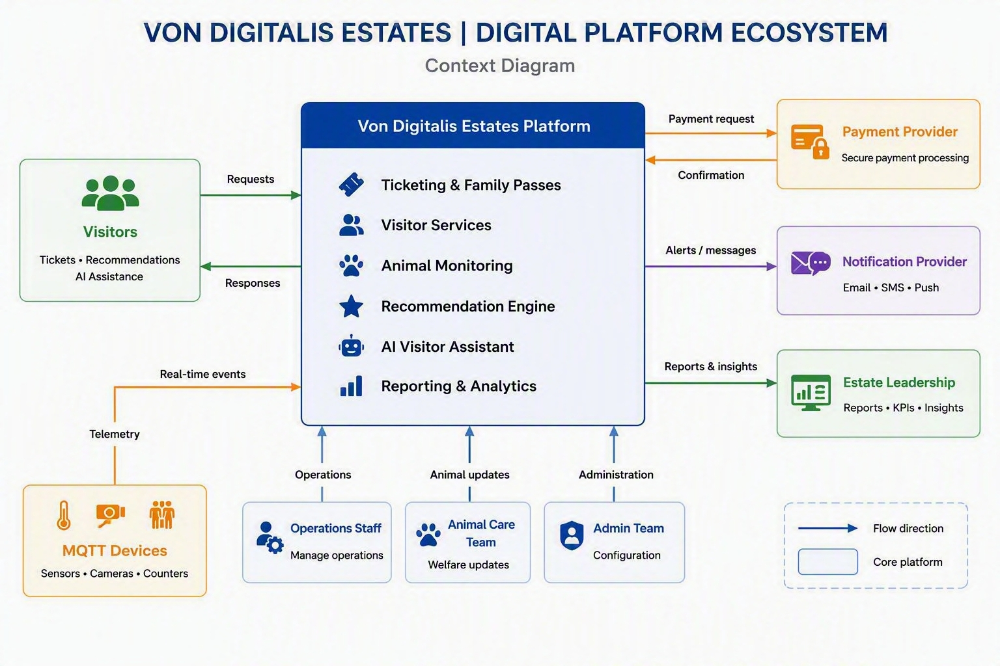

# Von Digitalis Estates | Digital Platform Ecosystem

## 1. Purpose

This context diagram provides a high-level view of the **Von Digitalis Estates Platform**, its primary users, operational teams, connected devices, external providers, and business stakeholders. The diagram focuses on the system boundary and the main information flows between the platform and surrounding actors.

## 2. Context Diagram

## 3. Core Platform Responsibilities

The **Von Digitalis Estates Platform** is the central system in the ecosystem. The platform supports the following capabilities:

- **Ticketing and Family Passes:** Handles visitor ticket and family-pass related services.
- **Visitor Services:** Supports digital services used during the visitor journey.
- **Animal Monitoring:** Receives and uses animal-related monitoring information.
- **Recommendation Engine:** Provides personalized recommendations to visitors.
- **AI Visitor Assistant:** Responds to visitor questions and assistance requests.
- **Reporting and Analytics:** Produces reports, KPIs, and business insights.

## 4. Actors and Connected Systems

### 4.1 Visitors

Visitors interact with the platform to use ticketing, recommendations, and AI assistance.

**Information flows:**

- **Visitors → Platform:** Requests
- **Platform → Visitors:** Responses

### 4.2 MQTT Devices

MQTT-connected sensors, cameras, and counters provide operational data to the platform.

**Information flows:**

- **MQTT Devices → Platform:** Telemetry and real-time events

### 4.3 Operations Staff

Operations Staff use the platform to manage operational activities.

**Information flow:**

- **Operations Staff → Platform:** Operations updates

### 4.4 Animal Care Team

The Animal Care Team provides animal welfare and monitoring updates.

**Information flow:**

- **Animal Care Team → Platform:** Animal updates

### 4.5 Admin Team

The Admin Team manages platform administration and configuration.

**Information flow:**

- **Admin Team → Platform:** Administration and configuration

### 4.6 Payment Provider

The external Payment Provider processes payment transactions initiated by the platform.

**Information flows:**

- **Platform → Payment Provider:** Payment request
- **Payment Provider → Platform:** Payment confirmation

### 4.7 Notification Provider

The Notification Provider supports outbound visitor communications through email, SMS, and push notifications.

**Information flow:**

- **Platform → Notification Provider:** Alerts and messages

### 4.8 Estate Leadership

Estate Leadership consumes reporting information generated by the platform.

**Information flow:**

- **Platform → Estate Leadership:** Reports and insights

## 5. Interaction Summary

| Source | Destination | Directional Label | Purpose |
|---|---|---|---|
| Visitors | Von Digitalis Estates Platform | Requests | Submit ticketing, recommendation, and assistance requests |
| Von Digitalis Estates Platform | Visitors | Responses | Return platform responses and visitor information |
| MQTT Devices | Von Digitalis Estates Platform | Telemetry / Real-time events | Provide sensor, camera, and counter data |
| Operations Staff | Von Digitalis Estates Platform | Operations | Provide operational updates |
| Animal Care Team | Von Digitalis Estates Platform | Animal updates | Provide animal welfare and monitoring updates |
| Admin Team | Von Digitalis Estates Platform | Administration | Manage platform configuration |
| Von Digitalis Estates Platform | Payment Provider | Payment request | Initiate payment processing |
| Payment Provider | Von Digitalis Estates Platform | Confirmation | Return payment status |
| Von Digitalis Estates Platform | Notification Provider | Alerts / messages | Send email, SMS, and push communication requests |
| Von Digitalis Estates Platform | Estate Leadership | Reports & insights | Provide dashboards, KPIs, and business insights |

## 6. System Boundary

The context diagram treats the **Von Digitalis Estates Platform** as the core system. Visitors, staff teams, MQTT devices, external providers, and Estate Leadership are shown outside the core platform boundary. This separation makes ownership and integration points easier to understand.

## 7. Key Architectural Considerations

- Protect visitor, operational, payment, and telemetry data in transit and at rest.
- Authenticate users and authorize access according to role.
- Validate data received from devices and external providers.
- Design payment and notification integrations to handle temporary failures safely.
- Monitor platform services, integrations, device telemetry, and failed transactions.
- Maintain traceability across visitor requests, external calls, notifications, and reports.
- Scale visitor-facing services and telemetry processing independently when required.

## 8. Scope

### In Scope

- Visitor interactions with the digital platform
- Ticketing and family-pass services
- Visitor recommendations and AI assistance
- Animal monitoring and device telemetry
- Staff administration and operational updates
- Payment-provider integration
- Notification-provider integration
- Reporting and analytics for Estate Leadership

### Outside the Core Platform Boundary

- Internal implementation of the external Payment Provider
- Internal implementation of the Notification Provider
- Physical behavior of sensors, cameras, and counters
- Business activities performed outside the digital platform

## 9. Assumptions

- MQTT devices can send telemetry and event data to the platform through an approved integration path.
- The Payment Provider returns a payment confirmation or status.
- The Notification Provider supports email, SMS, or push delivery channels.
- Platform access for operational teams is controlled through authenticated user accounts and appropriate permissions.

