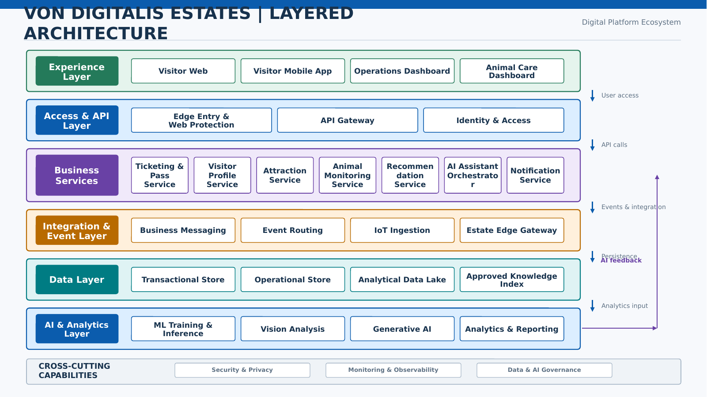

## Logical Architecture

### Purpose

This view groups the solution into logical layers so that responsibilities and dependencies remain clear without tying every element to a specific product.

### Architecture Diagram

### Layer Responsibilities

- **Experience Layer:** Provides visitor and staff interaction channels, including the visitor web application, mobile application, operations dashboard, and animal care dashboard.
- **Access and API Layer:** Provides edge protection, authentication, authorization, API routing, throttling, and policy enforcement.
- **Business Services:** Contains ticketing, visitor profile, attraction, animal monitoring, recommendation, AI assistant orchestration, and notification capabilities.
- **Integration and Event Layer:** Supports reliable asynchronous communication, event routing, IoT ingestion, and estate edge connectivity.
- **Data Layer:** Contains transactional, operational, analytical, and approved knowledge stores.
- **AI and Analytics Layer:** Supports machine learning, vision analysis, generative AI, analytics, and reporting.
- **Cross-Cutting Capabilities:** Applies security, privacy, monitoring, observability, data governance, and AI governance across the architecture.

### Logical Flow

1. Visitor and staff channels access the platform through the **Access and API Layer**.
2. The **Access and API Layer** routes authorized requests to the appropriate **Business Services**.
3. Business services use the **Integration and Event Layer** for messaging, events, and IoT-related processing.
4. Business and integration services store and retrieve information through defined **Data Layer** boundaries.
5. The **AI and Analytics Layer** consumes approved data for training, inference, vision analysis, generative AI, and reporting.
6. AI and analytics outputs return to business services through governed interfaces.
7. Cross-cutting security, privacy, observability, and governance controls apply across all relevant layers.

### Design Rules

- Business services do not directly trust device messages. The ingestion layer validates device identity and message structure.
- AI services do not directly update critical records without policy checks and, where required, human approval.
- Each service accesses data through defined ownership boundaries.
- Immediate visitor interactions use APIs, while downstream processing uses events where practical.
- External and internal interfaces should be monitored for availability, latency, failures, and security events.
- Sensitive data should be protected according to its classification and access requirements.
