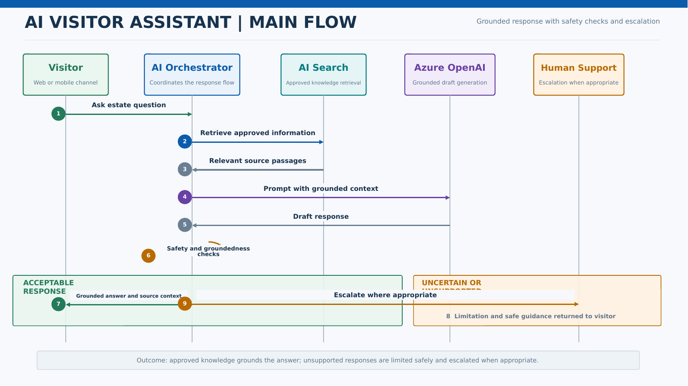

# AI Visitor Assistant

## Business Context

The assistant helps visitors find approved estate information, discover attractions, and plan an itinerary. Responses must be grounded in approved content and must not be treated as an authoritative source for emergencies or animal-care decisions.

## Actors

- Visitor
- AI Assistant Orchestrator
- Azure AI Search
- Azure OpenAI
- Content Owner
- Human Support

## Key Components

- Web or mobile chat interface
- Azure API Management
- AI orchestration service
- Azure AI Search
- Approved estate knowledge base
- Azure OpenAI
- Content safety and groundedness checks
- Feedback store
- Human escalation path

## Main Flow

## Data Flow

- The visitor submits a question.
- The orchestrator classifies intent and retrieves approved content.
- The model receives the question and retrieved context.
- Safety and groundedness checks evaluate the draft response.
- The system returns the response, states limitations where needed, and captures feedback.

## Error Handling and Fallback

- Do not invent an answer when approved sources do not support it.
- Provide deterministic emergency or safety guidance where approved.
- Use a basic search or FAQ experience if generation is unavailable.
- Escalate supported cases to human assistance.
- Rate-limit abusive or automated traffic.

## Security and Privacy Considerations

- Protect against prompt injection and unauthorized tool use.
- Do not expose hidden instructions, credentials, or restricted content.
- Use only approved indexed sources.
- Minimize and govern conversation retention.
- Apply content safety and access-aware retrieval.

## Performance and Scalability Considerations

- Stream responses where appropriate.
- Limit retrieval scope and prompt size.
- Cache approved common answers where safe.
- Monitor token usage, retrieval latency, generation latency, and timeout rate.

## Observability

- Groundedness and relevance evaluation
- Unsupported-answer rate
- Content safety events
- Retrieval and generation latency
- Token and request volume
- Fallback and escalation rate
- Visitor feedback

## Assumptions and Open Decisions

- Knowledge owners and update processes require confirmation.
- Supported languages and channels require confirmation.
- The model-provider and orchestration strategy are governed by Person 2 and Person 3 deliverables.

## Related Architecture

- [High-Level Design](../README.md)
- [End-to-End Architecture](../diagrams/end_to_end_architecture.md)
- [Data Flow](../diagrams/data_flow.md)
