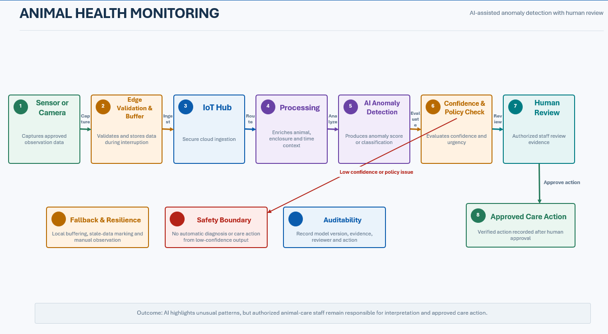

# Animal Health Monitoring

## Business Context

The animal collection requires careful monitoring. AI-assisted anomaly detection can highlight unusual patterns, but authorized animal-care staff remain responsible for interpretation and action.

## Actors

- Animal Care Team
- Sensors and Approved Cameras
- Edge Gateway
- Monitoring Service
- ML or Vision Model
- Operational Support

## Key Components

- Animal and enclosure sensors
- Approved cameras where suitable
- Edge Gateway and local buffer
- Azure IoT Hub
- Stream processing
- Operational and historical stores
- Azure Machine Learning or approved model
- Animal-care dashboard and alert workflow

## Main Flow

## Data Flow

- Sensors capture approved health or enclosure observations.
- The edge gateway validates and buffers observations.
- Cloud processing enriches observations with animal, enclosure, and time context.
- The model produces an anomaly score or classification.
- Policy evaluates confidence and urgency.
- Authorized staff review the evidence before care action is recorded.

## Error Handling and Fallback

- Continue local capture and buffering during network interruption.
- Mark missing or stale sensor data instead of treating it as healthy.
- Suppress automatic care action from low-confidence model output.
- Escalate device failure separately from animal-health anomalies.
- Use manual observation workflows when AI or sensors are unavailable.

## Security and Privacy Considerations

- Restrict animal-care data and actions to authorized roles.
- Protect device and camera credentials.
- Record model version, input references, output, reviewer, and action for audit.
- Apply retention controls to images and sensitive operational records.

## Performance and Scalability Considerations

- Prioritize urgent telemetry and alerts.
- Use edge filtering where it does not remove safety-relevant evidence.
- Scale inference independently from ingestion.
- Define alert freshness and review targets with animal-care stakeholders.

## Observability

- Sensor and camera health
- Observation freshness
- Model inference latency
- Confidence distribution
- False positive and false negative review outcomes
- Human-review completion
- Alert delivery status

## Assumptions and Open Decisions

- Veterinary and animal-care experts define acceptable sensors, labels, thresholds, and actions.
- Training and evaluation data availability is not yet confirmed.
- AI supports human decisions and does not independently diagnose or prescribe.

## Related Architecture

- [High-Level Design](../README.md)
- [End-to-End Architecture](../diagrams/end_to_end_architecture.md)
- [Data Flow](../diagrams/data_flow.md)
