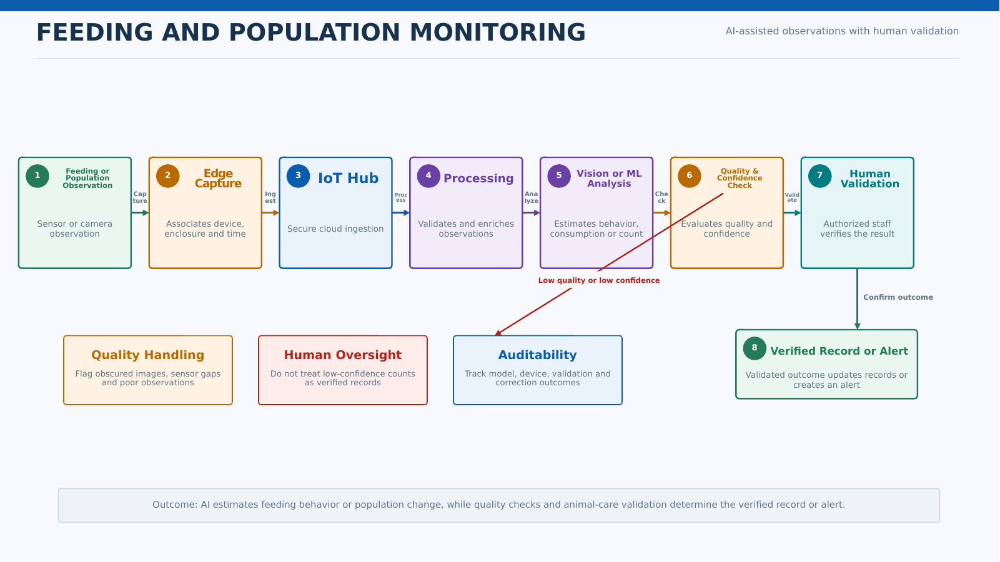
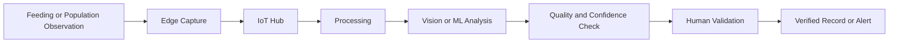

# Feeding and Population Monitoring

## Business Context

The estate wants to monitor how well animals are eating and, for selected species such as the jumping piranha collection, observe population levels. AI-assisted analysis must be validated by animal-care staff.

## Actors

- Animal Care Team
- Feeding Sensors
- Approved Cameras
- Edge Gateway
- Vision or ML Service
- Operations Support

## Key Components

- Feeding sensors and observation devices
- Approved imaging devices
- Edge Gateway
- Azure IoT Hub
- Event processing
- Azure AI Vision or approved model
- Operational data store
- Animal-care dashboard
- Human validation workflow

## Main Flow

## Data Flow

- Sensors or cameras capture feeding or population observations.
- Processing associates observations with enclosure, species, device, and time.
- AI estimates behavior, consumption, count, or change.
- Confidence and data-quality checks determine whether review is required.
- Validated outcomes update dashboards or create alerts.

## Error Handling and Fallback

- Flag obscured images, sensor gaps, and low-quality observations.
- Do not treat low-confidence counts as verified population records.
- Allow manual entry and correction by authorized staff.
- Buffer observations during connectivity loss.
- Track model and device failure separately.

## Security and Privacy Considerations

- Restrict access to live camera feeds and retained images.
- Use device certificates and secure provisioning.
- Audit corrections and validation outcomes.
- Apply minimum necessary retention for images and derived observations.

## Performance and Scalability Considerations

- Use scheduled or event-driven analysis based on operational need.
- Perform safe preprocessing at the edge to reduce transfer, where approved.
- Separate real-time alerts from non-urgent batch trend analysis.
- Validate count accuracy and freshness targets with domain experts.

## Observability

- Observation volume and freshness
- Image or sensor quality failures
- Model confidence and validation rate
- Count variance after human correction
- Device connectivity
- Alert delivery

## Assumptions and Open Decisions

- Approved observation methods differ by animal and enclosure.
- Ground-truth creation requires animal-care participation.
- No automated welfare action occurs without approved rules and human oversight.

## Related Architecture

- [High-Level Design](../README.md)
- [End-to-End Architecture](../diagrams/end_to_end_architecture.md)
- [Data Flow](../diagrams/data_flow.md)
