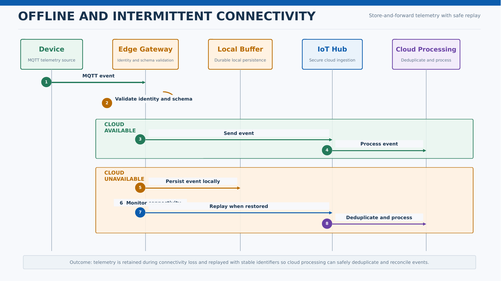

# Offline and Intermittent Connectivity

## Business Context

Patchy estate Wi-Fi means devices and local operations cannot assume continuous cloud connectivity. The architecture must preserve essential data and synchronize safely after connectivity returns.

## Actors

- MQTT Devices
- Edge Gateway
- Local Operator
- Azure IoT Hub
- Cloud Processing
- Operational Support

## Key Components

- MQTT-capable devices
- Edge Gateway
- Local durable buffer
- Connectivity monitor
- Azure IoT Hub
- Replay and reconciliation processing
- Device and platform monitoring

## Main Flow

 ## Data Flow

- Devices send locally timestamped messages to the edge gateway.
- The gateway validates and persists events before acknowledging where appropriate.
- When cloud connectivity is available, messages are transmitted securely.
- When connectivity is unavailable, messages remain in the local durable buffer.
- After recovery, replay preserves identifiers for deduplication and reconciliation.

## Error Handling and Fallback

- Alert authorized staff when buffer capacity or retention thresholds are approached.
- Reject unauthenticated or malformed device messages.
- Avoid silent data loss if replay fails.
- Quarantine repeatedly failing messages for investigation.
- Document manual fallback for essential observations.

## Security and Privacy Considerations

- Use unique device identities and certificate-based authentication.
- Encrypt buffered data where supported and required.
- Restrict physical and administrative access to gateways.
- Rotate credentials and support secure device decommissioning.
- Audit configuration and replay activity.

## Performance and Scalability Considerations

- Size local storage using validated message rate and outage assumptions.
- Use back-pressure when cloud or local resources are constrained.
- Prioritize critical health and device-status events.
- Control replay rate to avoid overwhelming cloud consumers.

## Observability

- Connectivity state and outage duration
- Local buffer usage and oldest-message age
- Replay throughput and failures
- Duplicate detection
- Device authentication failures
- Telemetry freshness

## Assumptions and Open Decisions

- Maximum expected outage, device count, and event rates require confirmation.
- Gateway hardware and local support model require confirmation.
- Safety-critical physical controls are outside this cloud-data design unless separately approved.

## Related Architecture

- [High-Level Design](../README.md)
- [End-to-End Architecture](../diagrams/end_to_end_architecture.md)
- [Data Flow](../diagrams/data_flow.md)
