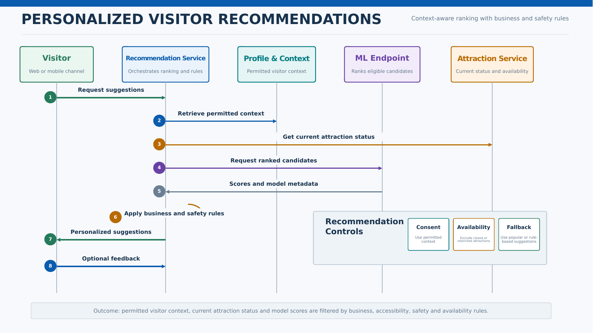

# Personalized Visitor Recommendations

## Business Context

Relevant suggestions can improve the visitor experience and encourage exploration. Recommendations should use permitted data, remain understandable, and degrade safely when models or profile data are unavailable.

## Actors

- Visitor
- Visitor Profile Service
- Recommendation Service
- Attraction Service
- ML Model
- Analytics Service

## Key Components

- Web or mobile channel
- Azure API Management
- Visitor Profile Service
- Recommendation Service
- Attraction and availability data
- Azure Machine Learning or approved model
- Cache
- Feedback pipeline

## Main Flow

## Data Flow

- The service collects permitted visitor context and current estate conditions.
- The model scores candidate attractions or activities.
- Business, accessibility, safety, and availability rules filter results.
- The visitor receives suggestions and may provide feedback.
- Feedback supports evaluation and future improvement under approved governance.

## Error Handling and Fallback

- Return popular or rule-based suggestions when profile data is unavailable.
- Use cached or deterministic recommendations when the model endpoint fails.
- Exclude unavailable or restricted attractions.
- Avoid blocking core ticketing when recommendations fail.

## Security and Privacy Considerations

- Use consented and purpose-appropriate visitor data.
- Minimize sensitive attributes in features.
- Restrict profile and feature access.
- Monitor for unfair or inappropriate recommendation patterns.
- Provide a way to use the service without personalization where required.

## Performance and Scalability Considerations

- Cache eligible attraction and recommendation data.
- Keep model inference outside ticket-payment transactions.
- Scale recommendation endpoints independently.
- Set latency and freshness targets during validation.

## Observability

- Inference latency and failure rate
- Fallback rate
- Recommendation acceptance or engagement
- Unavailable-attraction suppression
- Model and feature version
- Quality and fairness evaluation results

## Assumptions and Open Decisions

- Personalization consent and identity journeys require confirmation.
- Success metrics and acceptable model quality require business agreement.
- Attraction availability data must be sufficiently current.

## Related Architecture

- [High-Level Design](../README.md)
- [End-to-End Architecture](../diagrams/end_to_end_architecture.md)
- [Data Flow](../diagrams/data_flow.md)
