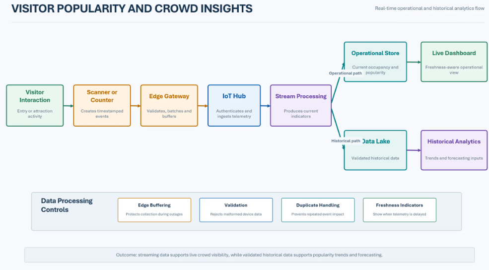

# Visitor Popularity and Crowd Insights

## Business Context

The estate needs evidence about attraction popularity and visitor distribution to support staffing, investment, and visitor-experience decisions.

## Actors

- Visitor
- Estate Operations Staff
- Attraction Counters and Scanners
- Edge Gateway
- Analytics Users

## Key Components

- Entry scanners and attraction counters
- MQTT-capable devices
- Edge Gateway with local buffering
- Azure IoT Hub
- Streaming processing
- Operational store
- Azure Data Lake Storage
- Analytics and reporting

## Main Flow

## Data Flow

- Devices create timestamped attraction or zone events.
- The edge gateway validates, batches, and buffers events.
- Cloud ingestion authenticates devices and routes telemetry.
- Streaming processing produces current occupancy or popularity indicators.
- Validated historical data supports trend analysis and forecasting.

## Error Handling and Fallback

- Buffer events locally during connectivity loss.
- Reject malformed or unauthenticated device messages.
- Detect duplicates and handle late-arriving events.
- Show data freshness on dashboards when telemetry is delayed.
- Avoid presenting predictions as confirmed facts.

## Security and Privacy Considerations

- Minimize collection of personally identifiable visitor data.
- Use aggregation or pseudonymization where individual identity is not needed.
- Secure device identity and certificate lifecycle.
- Restrict access to detailed movement data.
- Apply retention and deletion rules.

## Performance and Scalability Considerations

- Partition streams by estate zone or device group where appropriate.
- Scale ingestion and consumers based on message volume.
- Use current operational stores for dashboards and the lake for historical analytics.
- Validate freshness targets against operational decisions.

## Observability

- Device connectivity
- Telemetry freshness
- Ingestion error rate
- Processing delay
- Duplicate and late-event rate
- Dashboard refresh status

## Assumptions and Open Decisions

- Sensor types, event frequency, and zone definitions require confirmation.
- The lawful and acceptable visitor-tracking approach requires approval.
- Crowd thresholds and dashboard consumers require confirmation.

## Related Architecture

- [High-Level Design](../README.md)
- [End-to-End Architecture](../diagrams/end_to_end_architecture.md)
- [Data Flow](../diagrams/data_flow.md)
