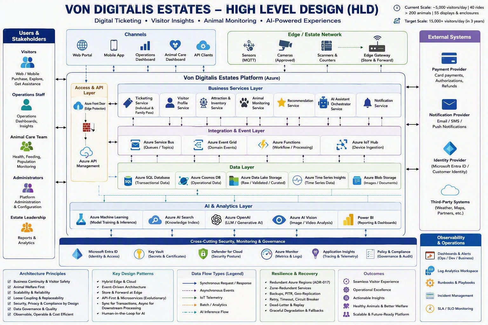

**Von Digitalis Estates**

**High-Level Design Architecture Description**

*Digital Ticketing \| Visitor Insights \| Animal Monitoring \| AI-Powered Experiences*

| **Document field** | **Value** |
|----|----|
| Project | Von Digitalis Estates Digital Platform |
| Document type | High-Level Design description |
| Status | Draft for architecture review |
| Prepared date | 09 September 2026 |
| Intended audience | Architecture reviewers, engineering teams, security, operations and business stakeholders |

# 1. Executive Summary

The Von Digitalis Estates digital platform provides a scalable Azure-based foundation for digital ticketing, family passes, visitor insights, estate operations, animal monitoring, personalized recommendations and a grounded AI visitor assistant. The architecture uses a hybrid edge-and-cloud approach so the estate can continue collecting essential device information during intermittent connectivity while Azure provides centralized processing, data storage, analytics, AI, governance and operations.

The HLD separates the platform into clear layers. Visitor and staff channels access governed APIs; business services own capability logic; integration services decouple downstream processing; IoT devices communicate through an estate edge gateway and Azure IoT Hub; data platforms separate transactional, operational and analytical information; and AI services use governed data with safety and human-review controls.

# 2. Business Context and Scale

| **Business area** | **HLD response** |
|----|----|
| Visitor growth | Supports growth from approximately 5,000 to at least 15,000 visitors per day. |
| Estate operations | Supports 40 rides and visitor popularity or crowd insights. |
| Animal care | Supports monitoring for more than 200 animals across 55 displays and enclosures. |
| Connectivity | Uses an edge gateway and store-and-forward buffering for patchy Wi-Fi. |
| Digital experience | Provides ticketing, recommendations and a grounded visitor assistant. |
| Governance | Applies security, privacy, observability, audit and controlled architectural decisions across the platform. |

# 3. HLD Architecture at a Glance

| **Users and devices** | **Channels and edge** | **Access and APIs** | **Business services** | **Events and data** | **AI and outcomes** |
|----|----|----|----|----|----|

The architecture is organized so each layer has a clear responsibility. Immediate visitor transactions use synchronous APIs, while notifications, analytics, telemetry and other downstream activities use asynchronous messaging or streaming where appropriate.

# 4. Users and Stakeholders

| **Stakeholder** | **Primary interaction** |
|----|----|
| Visitors | Use web or mobile channels to purchase tickets, explore attractions, receive recommendations and ask the AI assistant for approved estate information. |
| Operations staff | Use operational dashboards for attraction status, visitor distribution, device health and operational insights. |
| Animal care team | Review animal health, feeding and population observations, validate AI-assisted findings and record authorized actions. |
| Administrators | Manage platform configuration, identities, policies and operational settings. |
| Estate leadership | Review reports, KPIs and analytical insights for business and operational decisions. |

# 5. Channels and Estate Edge

## 5.1 Digital Channels

- Web portal and mobile application for visitor journeys.

- Operations dashboard for estate monitoring and insights.

- Animal-care dashboard for observations, alerts and human review.

- API clients for approved system-to-system access.

## 5.2 Edge and IoT Layer

Sensors, approved cameras, scanners and counters communicate through the estate edge gateway. The gateway validates messages, monitors connectivity and stores events locally when cloud connectivity is unavailable. After connectivity returns, the gateway replays events securely while preserving identifiers used for deduplication and reconciliation.

- MQTT-capable sensors and approved cameras

- Scanners and attraction counters

- Edge gateway with local durable buffer

- Azure IoT Hub for device identity and cloud ingestion

- Priority handling for important animal-health and device-status events

# 6. Access and API Layer

Azure Front Door and web protection form the public entry point. Azure API Management provides a governed API boundary for visitor channels, staff applications, partners and cross-domain access. The gateway applies authentication and authorization validation, routing, throttling, versioning, correlation and standardized error handling. Business logic remains in the application services, not in gateway policies.

# 7. Business Services Layer

| **Service** | **Responsibility** |
|----|----|
| Ticketing and Family Pass Service | Manages products, orders, tickets, family passes, entitlements, payment status and confirmation. |
| Visitor Profile Service | Manages visitor profile, preferences, consent and permitted personalization context. |
| Attraction and Inventory Service | Provides attraction availability, inventory and operational status used by ticketing and recommendations. |
| Animal Monitoring Service | Processes approved animal and enclosure observations, alerts, review outcomes and care-related records. |
| Recommendation Service | Returns model-assisted or rules-based attraction suggestions without blocking core ticketing. |
| AI Assistant Orchestrator | Retrieves approved knowledge, invokes the generative AI service, applies safety and groundedness controls, and provides fallback or escalation. |
| Notification Service | Sends approved ticket confirmations, alerts and communications through external providers. |

# 8. Integration and Event Layer

The integration layer supports different communication needs rather than using one technology for every interaction.

| **Component** | **Use** |
|----|----|
| Azure Service Bus | Durable business commands, workflow queues, topics, retries and dead-letter handling. |
| Azure Event Grid | Lightweight domain and platform event distribution. |
| Azure Functions | Event processing, validation, transformation, orchestration and lightweight workflows. |
| Azure IoT Hub | Authenticated device connectivity, telemetry ingestion and IoT routing. |

## 8.1 Communication Patterns

- Synchronous request-response for immediate visitor queries, ticket purchase and payment authorization.

- Asynchronous events for ticket lifecycle processing, notifications, analytics and workflows.

- IoT streaming for device telemetry, animal observations, attraction counters and device health.

- Batch processing for governed analytics, historical reporting and model training.

- Retrieval-augmented generation for grounded visitor assistance.

# 9. Data Layer

| **Data service** | **Purpose** |
|----|----|
| Azure SQL Database | System of record for orders, tickets, family passes, entitlements and payment transaction state. |
| Azure Cosmos DB | Flexible operational and visitor-context data where independently justified. |
| Azure Data Lake Storage | Raw, validated and curated analytical data for reporting and approved AI use cases. |
| Time-series or operational store | Current and historical telemetry or observation data for operational monitoring. |
| Blob or document storage | Approved images, documents and knowledge-source content under retention and access controls. |

Data ownership boundaries separate transactional, visitor, operational, animal-care, analytical and AI information. The design uses strong consistency for payment and confirmed ticket state, while analytics, notifications, recommendations and telemetry processing can use eventual consistency with reconciliation controls.

# 10. AI and Analytics Layer

| **Capability** | **Description and control** |
|----|----|
| Azure Machine Learning | Supports model training, registration, deployment, inference, evaluation and drift monitoring. |
| Azure AI Search | Retrieves approved estate knowledge for the visitor-assistant experience. |
| Azure OpenAI | Generates grounded visitor responses from approved retrieved content. |
| Azure AI Vision or approved model | Supports approved image or video analysis for animal monitoring with human validation. |
| Power BI | Provides business, operations, device-health, animal-monitoring and AI-quality dashboards. |

AI outputs that may affect animal welfare are treated as decision support. Confidence, evidence, human review, override and audit records are required. The visitor assistant must not invent unsupported answers and should return deterministic fallback content or escalate when approved knowledge is insufficient.

# 11. External Systems

- Payment provider for authorization, payment outcomes and refunds. Raw card information should remain outside the estate platform unless explicitly required and approved.

- Notification provider for email, SMS or push delivery. Notification failure does not reverse a valid ticket transaction.

- Microsoft Entra ID or an approved customer identity service for identity and access.

- Other approved third-party services, such as maps, weather or partners, accessed through governed interfaces where required.

# 12. Cross-Cutting Security, Monitoring and Governance

| **Control area** | **HLD approach** |
|----|----|
| Identity and access | Microsoft Entra ID for workforce users, approved customer identity for visitors, managed identities for Azure workloads and least-privilege RBAC. |
| Secrets and certificates | Azure Key Vault with controlled rotation, revocation and access. |
| Network and API protection | Front Door, WAF, API Management, segmentation and private connectivity where justified by risk. |
| Security posture | Defender for Cloud, vulnerability monitoring, audit and policy controls. |
| Privacy | Data minimization, consent or approved basis where applicable, retention limits and access controls. |
| Governance | Architecture decisions, policy compliance, ownership, audit evidence and review triggers. |

# 13. Observability and Operations

Azure Monitor, Application Insights and centralized Log Analytics provide metrics, structured logs, distributed traces, dashboards and actionable alerts. Correlation identifiers and W3C trace context are propagated where supported across APIs, messages, IoT flows and AI orchestration.

- API latency, error rates and purchase success

- Queue backlog, retries and dead-letter counts

- Device connectivity, telemetry freshness and edge-buffer health

- Animal observation freshness and alert delivery

- AI groundedness, model quality, latency, drift and fallback rate

- Release, failover and recovery indicators

- Runbooks, escalation paths and incident ownership

# 14. Resilience and Recovery

- Bounded retries with exponential backoff and jitter

- Dependency timeouts and circuit breakers

- Bulkhead isolation for ticketing and animal-monitoring workloads

- Idempotency for purchases, event consumers and telemetry replay

- Dead-letter handling and controlled replay

- Edge store-and-forward during connectivity loss

- Backup, restore, failover, failback and reconciliation testing

- Graceful degradation using cached, rules-based or limited-function responses

Final zone and regional deployment patterns, service tiers, RTOs and RPOs must be approved from business criticality, compliance, availability and cost evidence. A secondary region or active-active design should not be assumed for every capability.

# 15. Principal End-to-End Flows

## 15.1 Ticket Purchase

| **Visitor channel** | **Front Door and APIM** | **Ticketing service** | **Payment and SQL** | **Event and notification** |
|----|----|----|----|----|

The visitor submits a request through protected channels. The ticketing service validates availability, price and idempotency, obtains the payment outcome, commits the confirmed transaction and publishes a lifecycle event for notification and analytics processing.

## 15.2 IoT and Animal Monitoring

| **Sensor or camera** | **Edge validation** | **IoT Hub** | **Processing and model** | **Human review and alert** |
|----|----|----|----|----|

Approved observations are validated and buffered at the edge, ingested securely, enriched and evaluated. Low-confidence or high-severity results are routed to authorized animal-care staff. AI does not independently perform animal-care actions.

## 15.3 AI Visitor Assistant

| **Visitor question** | **API and orchestrator** | **AI Search retrieval** | **Azure OpenAI** | **Safety, response or escalation** |
|----|----|----|----|----|

The orchestrator retrieves approved estate information before generation. Safety and groundedness checks evaluate the output. Unsupported requests use fallback content or an approved escalation path.

# 16. Architecture Principles

- Business continuity and visitor safety

- Animal welfare first

- Hybrid edge and Azure cloud

- Event-driven architecture with synchronous APIs where immediate results are required

- Modular business capabilities and explicit ownership boundaries

- Security, privacy and compliance by design

- Human-in-the-loop controls for consequential AI

- Observable, operable and cost-aware services

- Replaceable components and controlled architectural evolution

# 17. Assumptions and Open Decisions

| **Topic** | **Current position** |
|----|----|
| Connectivity | Estate connectivity is intermittent; maximum outage duration and replay volume require confirmation. |
| Devices | Device types, counts, payload sizes, message frequency and gateway hardware require confirmation. |
| Regions and capacity | Azure regions, service tiers, quotas and regional topology require validation. |
| NFRs | Numeric availability, latency, throughput, RTO and RPO targets remain to be agreed. |
| External providers | Payment, notification and other third-party providers require final selection and contract validation. |
| Privacy and retention | Visitor tracking, consent, image retention and data-deletion requirements require approval. |
| AI quality | Models, evaluation datasets, confidence thresholds, language support and fallback criteria require validation. |

# 18. Risks and Mitigations

| **Risk** | **Mitigation** |
|----|----|
| Connectivity loss | Use edge buffering, controlled replay, deduplication and manual fallback. |
| Duplicate or inconsistent transactions | Use idempotency, transactional state, immutable references and reconciliation. |
| Compromised device or credential | Use per-device identity, certificates, revocation, least privilege and monitoring. |
| Unsupported AI output | Use approved retrieval, safety checks, confidence thresholds, evaluation and human review. |
| Message backlog or poison messages | Use capacity monitoring, retries, dead-letter queues, quarantine and replay procedures. |
| Excess logging or sensitive-data exposure | Apply classification, redaction, retention tiers, access controls and safe telemetry design. |
| Unvalidated multi-region cost or complexity | Choose resilience topology by capability after NFR and business-impact validation. |

# 19. Related Architecture Decisions

The HLD is supported by ADR-001 through ADR-016. ADR-017 and ADR-018 can be included if the submission requires explicit decisions for regional deployment/failover and CI/CD/infrastructure-as-code governance. These decisions should be referenced from the HLD rather than creating a separate HLD.

# 20. Conclusion

The proposed HLD provides a coherent architecture for visitor services, estate insights, animal monitoring, IoT, analytics and responsible AI. The layered structure improves separation of concerns, while event-driven integration, edge resilience, Zero Trust, centralized observability and human-governed AI provide the controls needed for a scalable and reviewable solution. Detailed implementation choices remain subject to approved NFRs, security review, load testing, operational readiness and cost analysis.
